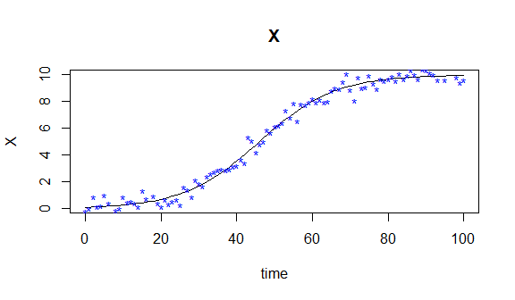

Sample Document
================


<!-- README.md is generated from README.Rmd. Please edit that file -->

# pCODE

<!-- badges: start -->

<!-- badges: end -->

The `R` package `pCODE` offers more user-friendly functions for
estimating ODE models without specifying any derivatives. `pCODE` also
includes a bootstrap variance estimator in addition to the estimator
obtained by Delta method. `pCODE` uses k-fold cross-validation for
choosing an optimal penalty parameter. The estimation procedure follows
Ramsay et al. (2007) which presents a new approximation strategy in the
family of collocation methods. It combines data smoothing with
generalized profiling algorithm to estimate parameters of an ODE model
where the solutions are subsequently obtained upon the parameter
estimates.

## Installation

For now, the developing package can be installed
[GitHub](https://github.com/) with:

``` r
# install.packages("devtools")
devtools::install_github("Aleks1123/pCODE")
```

The package is being submitted to \[CRAN\], and later you can install
the released version of PCODE from [CRAN](https://CRAN.R-project.org)
with:

``` r
install.packages("pCODE")
```

## Example

A simple illustration uses an one-dimensional ODE model \[
\dot{X} = \theta X (1-\frac{X}{10})
\] The following code defines the forementioned model that will be
provided for `pcode` for estimating parameters and `ode` for obtaining
numeric solution:

``` r
#load dependencies
library(pCODE)
library(deSolve)
library(fda)
library(MASS)
library(pracma)
library(Hmisc)
#set seed for reproducibility
set.seed(123)
ode.model <- function(t,state,parameters){
            with(as.list(c(state,parameters)),{
                 dX <- theta*X*(1-X/10)
                return(list(dX))})}
```

Let \(\theta = 0.1\) and \(X(0) = 0.1\)

``` r
#define model parameters
model.par   <- c(theta = c(0.1))
#define state initial value
state       <- c(X     = 0.1)
```

Given an observation period of \([0,100]\), random noise errors are
added to the ODE solution with a Normal distribution
\(\text{N}(0,0.5^{2})\). Observations are generated as follows:

``` r
times  <- seq(0,100,length.out=101)
mod    <- ode(y=state,times=times,func=ode.model,parms = model.par)
nobs   <- length(times)
scale  <- 0.5
noise  <- scale * rnorm(n = nobs, mean = 0 , sd = 1)
observ <- mod[,2] + noise
```

Subsequently, we can visualize the observations along the true solution
of this simple ODE model as

``` r
#plot simulated data against generating model
plot(mod,ylab=names(state))      #curve
points(times, observ,pch='*',col='blue')    #observation
```


First, a basis object needs to be defined by `create.bspline.basis` from
`fda` package for smoothing observations. A B-spline basis is created
given 21 konts including both interior and boundary knots acorss
observation interval \((0,100)\). The order of basis functions is 4, so
there is a total of 23 basis functions.

``` r
#Generate basis object for interpolation and as argument of pcode
#21 konts equally spaced within [0,100]
knots <- seq(0,100,length.out=21)
#order of basis functions
norder <- 4
#number of basis funtions
nbasis <- length(knots) + norder - 2
#creating Bspline basis
basis  <- create.bspline.basis(c(0,100),nbasis,norder,breaks = knots)
```

To perform parameter cascade method for estimating both structural and
nuisance parameters, one can use `pcode` in the following way

``` r
#parameter estimation
pcode.result <- pcode(data = observ, time = times, ode.model = ode.model,
                      par.initial = 0.3, par.names = 'theta',state.names = 'X',
                      basis.list = basis, lambda = 1e2)
```

The structural parameter and nuisance parameter estiamtes can be called
by

``` r
pcode.result$structural.par
#>      theta 
#> 0.09995229
pcode.result$nuisance.par
#>  [1]  0.1232160  0.1550332  0.1903906  0.2729993  0.4284428  0.6134020
#>  [7]  1.0222183  1.6891098  2.5351231  3.5543293  4.8116926  6.0699739
#> [13]  7.2145361  8.0734588  8.7456720  9.2110485  9.4866269  9.7101657
#> [19]  9.8736650  9.9650449 10.0098433  9.9950749  9.9846698
```

## References

<div id="refs" class="references">

<div id="ref-parcascade">

Ramsay, J. O., G. Hooker, D. Campbell, and J. Cao. 2007. “Parameter
Estimation for Differential Equations: A Generalized Smoothing
Approach.” *Journal of the Royal Statistical Society. Series B
(Statistical Methodology)* 69 (5): 741–96.

</div>

</div>
